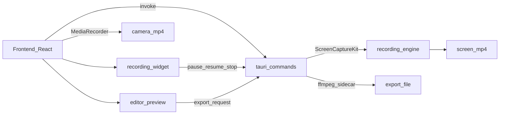

# macOS Tauri video recorder + editor plan

## Context (current repo)

- Frontend is **React 19 + Vite 7** (`/Users/tommaso/personal-projects/open-rec/package.json`).
- Backend is **Tauri v2** with only the `greet` command today.
```1:14:/Users/tommaso/personal-projects/open-rec/src-tauri/src/lib.rs
// Learn more about Tauri commands at https://tauri.app/develop/calling-rust/
#[tauri::command]
fn greet(name: &str) -> String {
    format!("Hello, {}! You've been greeted from Rust!", name)
}

#[cfg_attr(mobile, tauri::mobile_entry_point)]
pub fn run() {
    tauri::Builder::default()
        .plugin(tauri_plugin_opener::init())
        .invoke_handler(tauri::generate_handler![greet])
        .run(tauri::generate_context!())
        .expect("error while running tauri application");
}
```


## Key decisions (locked)

- **Minimum macOS**: **15+**
- **Audio**: **system audio + microphone**, separately togglable

## Proposed architecture

- **Recording engine (Rust)**: macOS **ScreenCaptureKit** via the Rust crate `screencapturekit` (feature `macos_15_0`).
  - Source selection: enumerate displays/windows via `SCShareableContent`, and optionally use `SCContentSharingPicker` (system UI).
  - Recording: use `SCRecordingOutput` (direct-to-file) to generate `screen.mp4` with H.264 + AAC, including system audio and mic when toggled.
- **Recording controls widget (Frontend + Tauri window)**: a tiny, always-on-top “mini window” shown during recording.
  - Controls: pause/resume + stop (and a timer).
  - Implementation note: if ScreenCaptureKit doesn’t expose a reliable pause/resume for file recording, we’ll implement pause as “segment recording” (stop writing to the current file, resume into a new `screen_partN.mp4`) and stitch segments during export.
- **Camera (Frontend)**: `getUserMedia()` for preview + `MediaRecorder` to record **video-only** `camera.mp4` when enabled.
  - Store a small **sync offset** in project metadata (record the start timestamps of each stream; allow a simple “camera offset” tweak in editor if needed).
- **Project model (JSON)**: non-destructive “edit decision list” (EDL) stored alongside assets.
  - Stored under an app-managed folder: `recordings/<projectId>/{screen.mp4,camera.mp4?,project.json}`.
- **Editor preview (Frontend)**: fast, no re-encode.
  - Cut: skip removed ranges.
  - Speed: `video.playbackRate` per segment.
  - Zoom: apply CSS transform per segment.
- **Export (Rust + ffmpeg sidecar)**: generate final output applying all edits.
  - Bundle `ffmpeg` as a **Tauri v2 sidecar** (`bundle.externalBin`) and run it via the **shell plugin**.
  - Export targets (v1): **MP4** and **GIF**; options for resolution, FPS, and compression presets (matching the screenshot).



## UX (inspired by screenshots)

- **Recorder view** (small window):
  - Capture source controls: segmented `Screen` / `Window`, plus dropdown list.
  - Toggles: `Camera`, `Microphone`, `System audio`.
  - Primary CTA: **Start Recording**.
- **Recording controls widget** (tiny floating window, appears after **Start Recording**):
  - Always-on-top, minimal chrome (no title bar), draggable.
  - Shows elapsed time and state (Recording / Paused).
  - Buttons: **Pause/Resume** and **Stop**.
- **Editor view**:
  - Left: video preview + playback controls.
  - Bottom: timeline with clip + zoom slider.
  - Tools: **Cut**, **Zoom**, **Speed**.
  - Top-right: **Export** button.
- **Export modal**:
  - Format: MP4/GIF
  - FPS dropdown
  - Compression presets: Minimal / Social / Web / Potato
  - Resolution: 720p / 1080p / 4K

## Backend implementation details (Rust)

- Add modules:
  - [`src-tauri/src/recording/`](src-tauri/src/recording/): ScreenCaptureKit integration (source listing, start/stop recording).
  - [`src-tauri/src/project/`](src-tauri/src/project/): create/load/save `project.json`.
  - [`src-tauri/src/export/`](src-tauri/src/export/): ffmpeg args builder + spawn + progress parsing.
- Expose Tauri commands (examples):
  - `list_capture_sources()` → displays + windows
  - `start_screen_recording(options)` → returns `projectId` + paths
  - `pause_recording(projectId)` / `resume_recording(projectId)`
  - `stop_screen_recording(projectId)`
  - `export_project(projectId, exportOptions)` → emits progress events

## macOS permissions & packaging

- Create [`src-tauri/Info.plist`](src-tauri/Info.plist) and add:
  - `NSScreenCaptureUsageDescription`
  - `NSCameraUsageDescription`
  - `NSMicrophoneUsageDescription`
- Update [`src-tauri/tauri.conf.json`](src-tauri/tauri.conf.json):
  - `bundle.macOS.minimumSystemVersion`: `"15.0"`
  - `bundle.externalBin`: include `ffmpeg` (per-arch target triple filenames)
- Add shell plugin setup per Tauri v2 sidecar docs (`https://v2.tauri.app/develop/sidecar/`).

## Export engine (ffmpeg) approach

- Use a segment model (“keep segments”) and generate:
  - `trim/atrim + setpts/atempo` per segment
  - `concat` to stitch
  - per-segment zoom via `crop+scale` (constant zoom within a slice)
  - optional overlay of `camera.mp4` via `overlay`
- Map presets → (CRF, preset, audio bitrate), and resolution → `scale=-2:<targetHeight>`.

## Test plan (manual)

- **Recording**:
  - Screen-only (no audio)
  - Screen + system audio
  - Screen + mic
  - Screen + system + mic
  - Window capture (verify correct window)
  - Camera-only and Screen+Camera (verify both files saved)
  - Pause/resume from the floating widget (verify output duration and A/V continuity)
- **Editing**:
  - Cut removes ranges
  - Zoom applies only to selected slice
  - Speed (whole video + slice) keeps A/V in sync after export
- **Export**:
  - MP4 at 720p/1080p/4K, 30/60 FPS
  - GIF export works and respects FPS + resolution

## Not in v1 (explicitly deferred)

- Shareable links / cloud upload
- Clipboard export
- Background/padding/rounded-corners “frame” customization (can be added later)